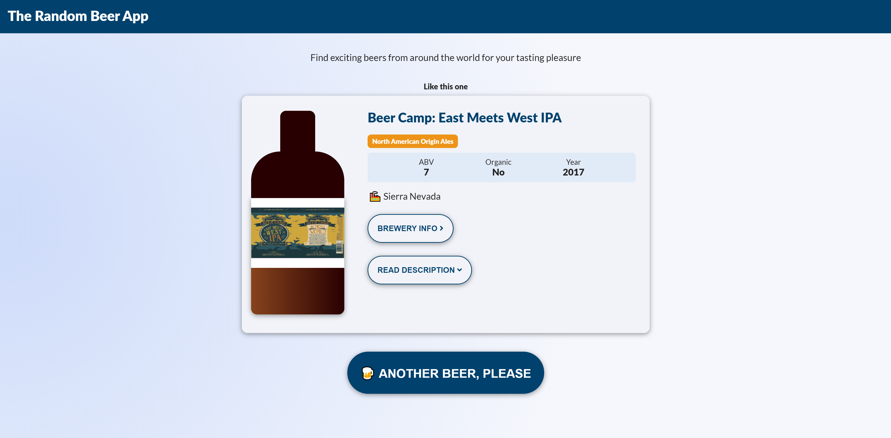

## The Random Beer App

CodeSandbox link: https://codesandbox.io/s/spring-bush-z6v04

Screenshot

# About

This is a tech test for Distilled.
I had a bit of fun with this one. I spent most of my time playing with styles.
I ended up making an odd looking beer bottle of of div tags but it was an idea I had early in the project so I wanted to stick with it.
I also included an animation for the card sliding in using Framer Motion.

# Instructions

On page load, a random beer will be displayed.
Basic information on the beer is shown.
You can expand/hide the description text.
Tapping on the Brewery Info will take you to the second page.
